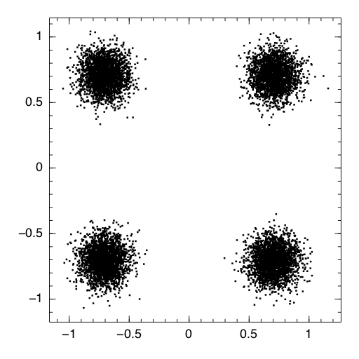
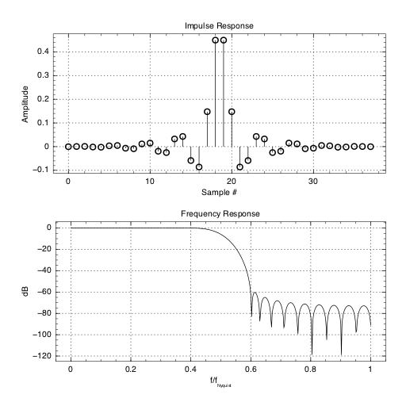

# **Radio.jl** #

A digital communications package for the Julia language.

## Installation ##

**Radio** is not yet registered with the Julia package mackamager, so it needs to cloned:

```jlcon
julia> Pkg.clone("https://github.com/JayKickliter/Radio.jl.git")
```

## Status ##

**Radio** is in its infancy. Right now (April 2014) I'm mostly working on support functions (filtering, resampling, noise), and have only implemeted PSK modulation. That said, if you have requests or suggestions, please submit them.

## Proposed Structure ##

This is a growing list of proposed functionality and package strcture.

* Modulation
	* **PSK**: Phase Shift Keying modulation/demodulation
	* **APSK**: Amplitude Phase Shift Keying modulation/demodulation
	* **QAM**: Quadrature Amplitude Modulation/demodulation 	
* Random
	* **WGN**: White Gaussian Noise
* Math
  * **CZT**: Chirp-z Transform
  * **FFT**: ?. Need a non-GPL FFT. Possibly a native Julia implemantation or an interface to [FFTS](https://github.com/anthonix/ffts)
* Filtering
	* **FIR**: Fir filter design and execution
	* **Polyphase**: Polyphase filter and execution
	* **Resampling**: Decimation, interpolation, and rational resampling. Maybe cubic interpolation.
* Support
  * **Types**: IQ
  * **Graphics**: Filter response, constellation plotting, eye diagram

## Examples ##

### QPSK Modulation ###

See `Examples/QPSK.jl`

```julia
using Radio, Winston

# generate 10,000 random QPSK symbols
symbols = pskmod( 10000, 4 )
# create some gaussian noise and add it to the symbols
noise  = wgn( length( symbols ), 10, "dBm", 1.0, true )
signal = symbols .+ noise

constellation = plot_constellation( signal )
setattr( constellation, title = "QPSK Modulation" )

display( constellation )
```


### 8-PSK Modulation ###

See `Examples/8-PSK.jl`

```julia
using Radio, Winston

# generate random 3 bit data modulate
data = rand( 0:7, 10000 )

# generate 10,000 random QPSK symbols
symbols = pskmod( data, 8 )
# create some gaussian noise and add it to the symbols
noise  = wgn( length( symbols ), 10, "dBm", 1.0, true )
signal = symbols .+ noise

constellation = plot_constellation( signal )
setattr( constellation, title = "8-PSK Modulation" )

display( constellation )
```


### FIR Filter Design With a Kaiser Window ###

See `Examples/Kaiser.jl`

```julia
using Radio, Winston

( M, Beta ) = kaiserord( 0.001, 0.2*π )
window = kaiser( M, Beta )
impulse = firdes( 0.5, window )
p = plot_response( impulseResponse )

display( p )
```
